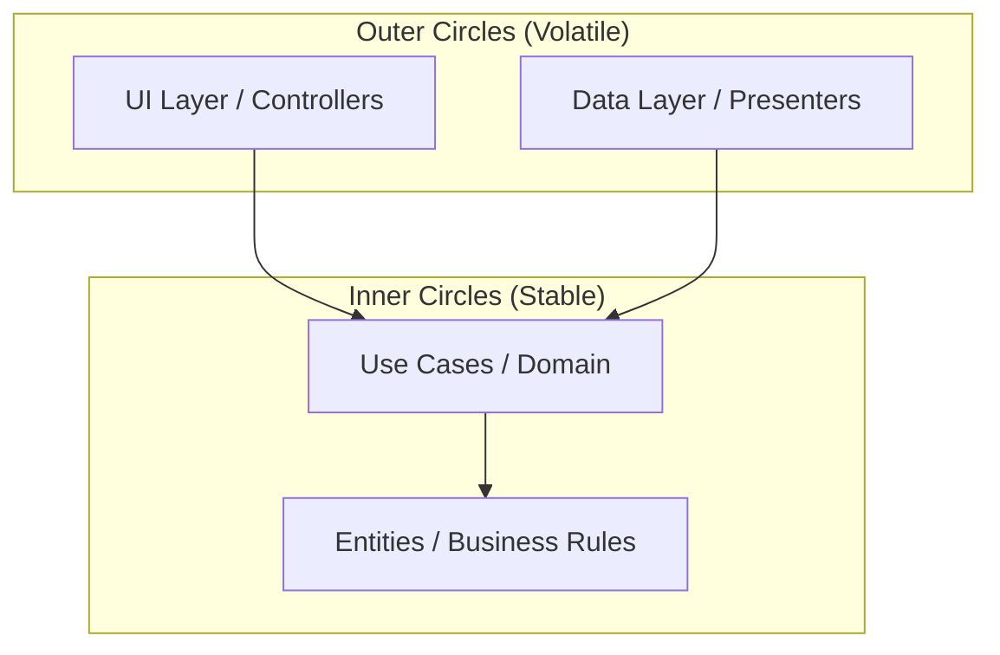

# Clean Architecture in Modern Android

Clean Architecture is a software design philosophy that promotes the separation of concerns, making the system easy to maintain, test, and adapt to changes.

## 1. The Core Layers

In Clean Architecture, layers are organized like an onion, with the dependency rule stating that **dependencies must only point inwards**.



### Entities (Inner Circle)

- PURE Kotlin/Java objects.
- Business entities that encapsulate the most general and high-level rules.
- Least likely to change when something external (UI, Database) changes.

### Use Cases (Interactors)

- Contains application-specific business logic.
- Coordinates the flow of data to and from the entities.
- Defines **what** the user can do (e.g., `GetProductListUseCase`, `AuthenticateUserUseCase`).

### Interface Adapters

- Converts data from the format most convenient for use cases and entities to the format most convenient for external agencies (UI, DB).
- ViewModels (UI) and Repositories (Data) live here.

## 2. The Dependency Rule

The dependency rule is the most important part: **Source code dependencies can only point inwards**.

- The `Domain` layer (Entities/Use Cases) must NEVER know about anything in the `Data` or `UI` layers.
- We achieve this through **Dependency Inversion**: Use interfaces in the Domain layer that are implemented in the Data layer.

## 3. Mapping Clean Architecture to MAD

Modern Android Development (MAD) simplifies some Clean Architecture concepts for productivity:

- **UI Layer**: (Presenters/ViewModels) + Jetpack Compose.
- **Domain Layer**: (Use Cases). Optional but recommended for complex apps.
- **Data Layer**: (Repositories + Data Sources like Room/Retrofit).

## 4. Key Benefits

- **Testability**: You can test the business logic without any UI or DB components.
- **Independence**: The UI can change from XML to Compose without touching the core logic.
- **Maintainability**: Clear boundaries prevent the emergence of "God Classes".

## 5. Implementation Pattern

```kotlin
// Domain Layer
class GetUserDetailUseCase(private val userRepository: UserRepository) {
    suspend operator fun invoke(id: String): User = userRepository.getUser(id)
}

interface UserRepository {
    suspend fun getUser(id: String): User
}

// Data Layer
class UserRepositoryImpl(private val apiService: ApiService) : UserRepository {
    override suspend fun getUser(id: String): User = apiService.fetchUser(id).toDomain()
}
```
