# Modularization Strategy in Modern Android

Modularization involves breaking your application into smaller, independent parts.

```mermaid
graph BT
    App[":app (Shell)"] --> FeatureA[":feature:home"]
    App --> FeatureB[":feature:profile"]
    FeatureA --> CoreUI[":core:ui"]
    FeatureB --> CoreUI
    FeatureA --> Domain[":core:domain"]
    FeatureB --> Domain
    Domain --> Data[":core:data"]
    Data --> Network[":core:network"]
    Data --> Database[":core:database"]
```



## 1. Why Modularize?

- **Faster Build Times**: Gradle can compile independent modules in parallel.
- **Improved Reusability**: Share code between different apps or target platforms.
- **Strict Separation of Concerns**: Enforce boundaries between different layers and features.
- **Team Scalability**: Large teams can work on different modules without merge conflicts.

## 2. Recommended Structures

### Layer-based Modularization

Divide the app by architectural layers:

- `:core`: Common utilities, themes, and base classes.
- `:data`: Repositories and data sources (Room, Retrofit).
- `:domain`: Use Cases and business logic.
- `:ui`: Standardized UI components (Design System).

### Feature-based Modularization

Divide the app by user-facing features:

- `:feature:auth`
- `:feature:profile`
- `:feature:home`

**The Goal**: A balanced approach where features depend on core/data/domain modules but NOT on each other.

## 3. Dependency Management: Version Catalogs

Use `libs.versions.toml` to manage all dependencies in one place.

```toml
[versions]
compose = "1.5.0"
hilt = "2.48"

[libraries]
compose-ui = { group = "androidx.compose.ui", name = "ui", version.ref = "compose" }
hilt-android = { group = "google.dagger", name = "hilt-android", version.ref = "hilt" }

[plugins]
android-application = { id = "com.android.application", version = "8.1.0" }
```

## 4. Navigation in Multi-module Apps

- **Feature-to-Feature**: Use high-level feature interfaces or deep links to navigate between modules without creating circular dependencies.
- **Coordinator Pattern**: Use a dedicated navigation module or the `:app` module to coordinate flows between features.

## 5. Internal Visibility

Use the `internal` modifier to hide implementation details within a module. Only expose what is absolutely necessary (usually interfaces or data classes).
